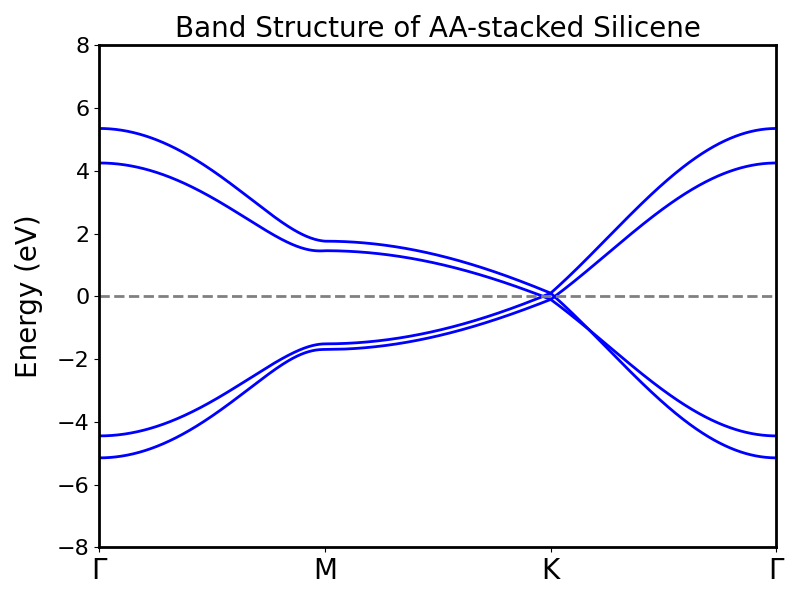
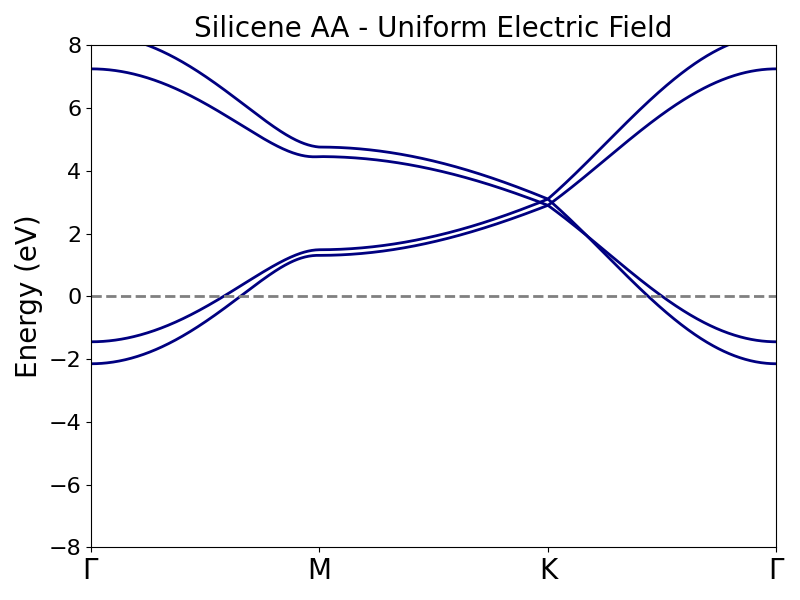
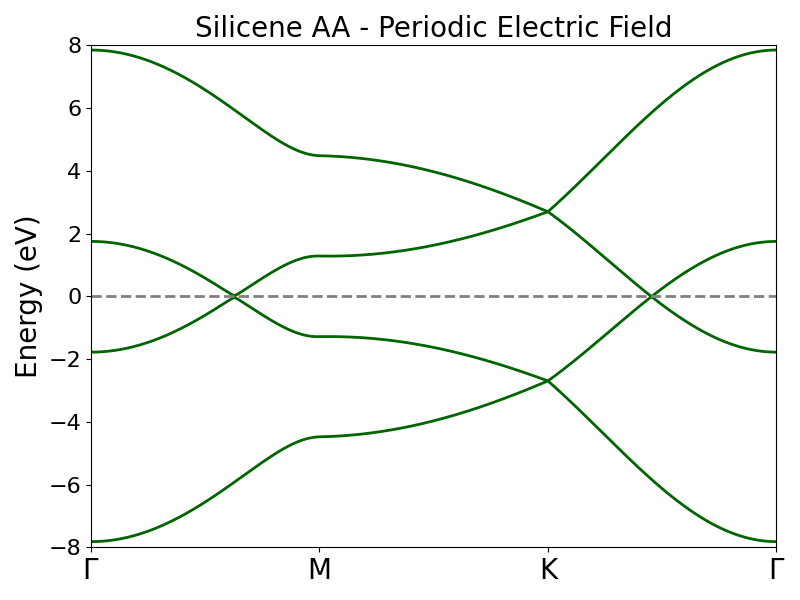
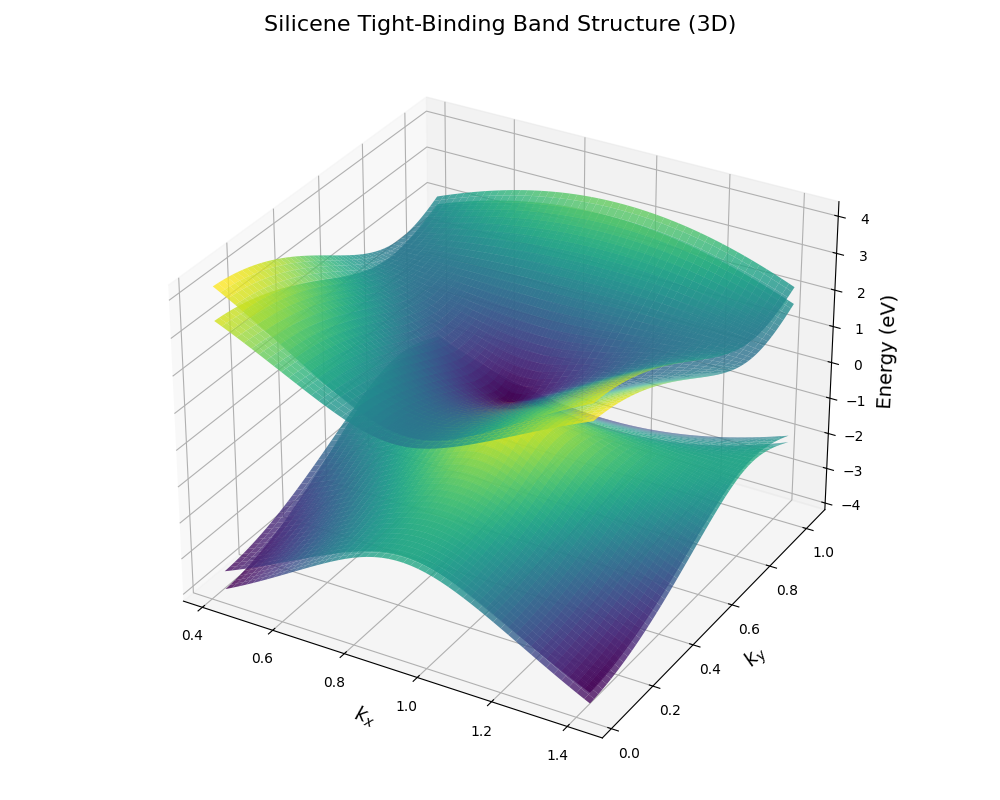
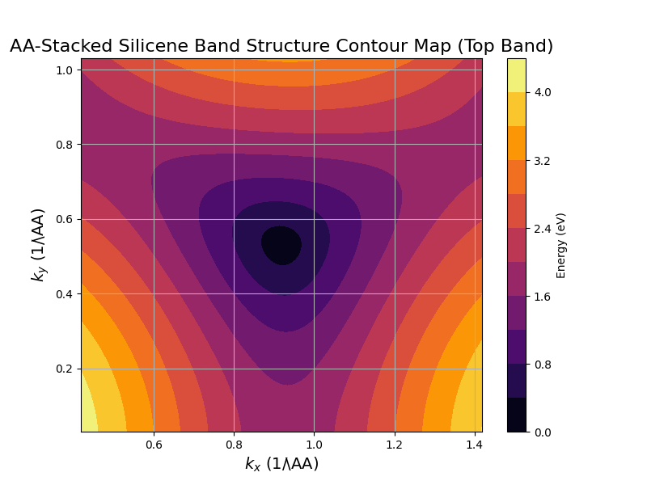

## AA-Stacked Bilayer Silicene: Tight-Binding Band Structure Under Electric Fields

This project investigates the electronic band structure of AA-stacked bilayer silicene using a tight-binding model. The simulation explores how interlayer coupling and external electric fields modify the energy spectrum, with visualizations of band dispersion along high-symmetry paths and across two-dimensional regions of k-space.

#### Key Features

* 4×4 tight-binding Hamiltonian for AA-stacked bilayer silicene
* Intralayer and interlayer hopping interactions
* Uniform and spatially modulated electric field perturbations
* Band structure calculations along Γ → M → K → Γ
* 2D energy dispersion and contour visualizations near the K point

#### Results

#### Physical Model

The system is modeled as AA-stacked bilayer silicene, where atoms in the upper layer are aligned vertically with atoms in the lower layer. The Hamiltonian includes intralayer hopping (t₀); vertical interlayer hopping (t₁); and skew interlayer hopping (t₂). The basis states are: (A₁, B₁, A₂, B₂). Band energies are obtained by diagonalizing the Bloch Hamiltonian throughout the Brillouin zone.

#### Electric Field Effects

Two types of external perturbations are considered: a uniform electric field (a constant on-site potential is applied to all lattice sites, producing an overall shift in the electronic bands) and a periodic electric field (a spatially modulated potential V(k) = V₀ cos(q·k) introduces momentum-dependent band modulation and modifies the symmetry of the spectrum).

#### Computational Methods

The simulation workflow is:

1. Construct the tight-binding Hamiltonian H(k)
2. Sample k-points along high-symmetry paths
3. Diagonalize using NumPy eigenvalue solvers
4. Generate band structure and k-space visualizations

#### Requirements

* Python 3.x
* NumPy
* Matplotlib

#### Key Findings

* Interlayer coupling strongly affects band splitting
* External electric fields provide tunable control of the electronic spectrum
* AA stacking preserves lattice symmetry while modifying degeneracies
* Periodic fields induce momentum-dependent band modulation

#### Author

Silvia Barnes

*Undergraduate Computational Physics Project*
